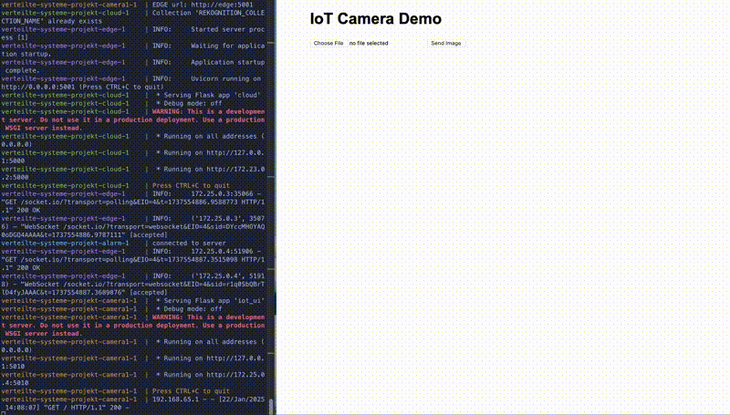

# Distributed Surveillance System

A distributed system for intruder detection using AWS services. The system processes video streams at the edge using YOLO for person detection and uses AWS Rekognition in the cloud for facial recognition.


## Demo
To run a simple demo with a web ui, run `docker-compose -f docker-compose-demo.yaml up --build`. Of course the credentials in `res/credentials/.aws/credentials` are needed. This sets up one camera instance with a web ui to upload images, edge and cloud instance. 




## Setup credentials

In order to use AWS Rekognition you need to provide credentials.

- Credentials in `res/credentials/.aws/credentials`. Here you can directly copy the credentials form the AWS Learners Lab and copy them into credentials. If the file is not present, create it!


Credentials are neede for boto3 initialisation and connecting to the rekognition client. 


## Simulation of topology with docker containers
To avoid deploying all the code to the cloud for testing, we can simulate the topology with docker containers.

In `/src` I created a `docker-compose.yml` file that defines the services and their configurations.
For each component in the network I created a Dockerfile and configured the container as a service in the `docker-compose file`. 

The dependency declaration for each container is stored in the `src/dependencies/` folder. There are all the python packages needed for the corresponding component.

in order to update the contents of this you can either run `pip freeze > dependencies/<component>.txt` or add them manually. 

Then the project can be executed using the following commands: 

```bash
# in the src directory
docker compose -f docker-compose.yaml up --build   # --build forces rebuild

# to stop all containers
docker compose down
``` 


## Collection of logs
After the docker containers run and the simulation produced sufficient logs, the logs in the corresponding directories in the containers `/app/logs` can be collected to the local host. Here the script `collect_logs.sh` comes into play. 

```bash
# if permissions are not right, change them (+x)
docker compose up --build 
# ...
# simulation runs for a few minutes
# ...

#after simulation stopped, run, saves logs to `res/collected_logs`
./collect_logs.sh
```


## Provisioning in cloud

For each layer (IoT, Edge, Cloud), I created a separate EC2 instance to run the distributed system. The Edge and Cloud instances need at least t2.medium instance type due to YOLO and AWS Rekognition requirements.

To set up a new instance:

1. Connect via SSH using the .pem file:
```bash
ssh -i ~/location/to/file.pem ec2-user@PUBLIC-IP
```

2. Install Docker and required tools:
```bash
sudo yum install docker -y
sudo service docker start 
sudo usermod -a -G docker ec2-user 
sudo chmod 666 /var/run/docker.sock

# install Docker Compose
sudo curl -L https://github.com/docker/compose/releases/latest/download/docker-compose-$(uname -s)-$(uname -m) -o /usr/local/bin/docker-compose
sudo chmod +x /usr/local/bin/docker-compose
```

3. Upload code to instances using the provided script:
```bash
# adapt IPs in script first
./upload_to_all_ec2.sh
```

4. Configure server addresses in docker-compose files:
In `docker-compose-edge` adapt CLOUD_URL. Note: Don't change port!
In `docker-compose-iot` adapt EDGE_URL. Note: Don't change port, except you want to add more edge devices. Needs changes in the security group and the docker-compose file.


5. Start the services on each instance:
```bash
# run on respective instances (cloud, edge, or iot)
docker-compose -f docker/docker-compose-[layer].yaml up --build
```
Replace [layer] with cloud, edge, or iot depending on which instance you're deploying to.

Make sure the EC2 security groups allow traffic on the required ports (5000 for Cloud, 5001, 5002 for Edge).


## Evaluation Results
Evaluation on the data in `res/iot_resources/evaluation_images/`.

### Dataset Composition
- Total images: 14
- Images with persons: 10
- Images without persons: 4
- Images with intruder: 6
- Images without intruder: 8

### Detection Performance
- YOLO Detection Accuracy: 10/14 correct detections
- Rekognition Performance: 3/10 intruder detections


### table
| img name | yolo person detected | rekognition intruder detected |
|----------|----------------------|-------------------------------|
| img1     |         True         |                    True       |
| img2     |         False        |                    /          |
| img3     |         False        |                    /          |    
| img4     |         False        |                    /          |    
| img5     |         False        |                    /          |
| img6     |         True         |                    True       |
| img7     |         False        |                    /          |
| img8     |         True         |                    True       |
| img9     |         False        |                    /          |
| img10    |         False        |                    /          |    
| img11    |         False        |                    False      |
| img12    |         True         |                    True       |
| img13    |         False        |                    /          |
| img14    |         False        |                    /          |


